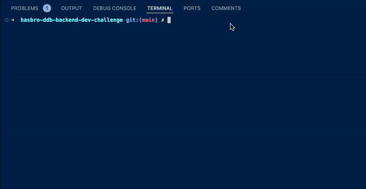
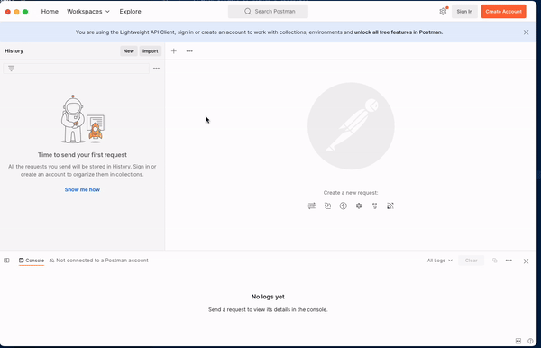
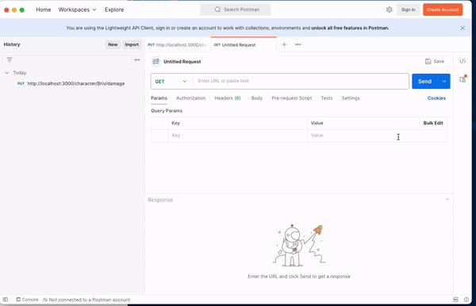
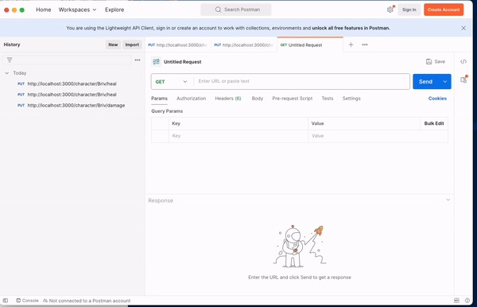

# DDB Back End Developer Challenge

## Introduction:

The primary purpose of this API project is to enable clients to perform various operations related to a character's hit point. This involves dealing damage (while considering the character's defense abilities), heal additional hit points and apply temporary hit points.

This back-end API project is built with the following tech stack:

- **Node.js**: For creating the server and managing backend logic.
- **Express.js**: to simulate RESTful API using HTTP requests.
- **MongoDB**: NoSQl used for storing data.
- **Docker**: Ensures the app is cross-functional in all environments.

Please refer to following Github page for more details: https://github.com/DnDBeyond/back-end-developer-challenge

## API Operations:

### PUT: /character/:name/damage

This endpoint applies damage to the specified character's hit points. It expects a `name` in the URL's parameter and a JSON payload with a `damage` (integer) and `type` (string) property.

### PUT: /character/:name/heal

This endpoint heals a specified character's hit points. It expects a `name` in the URL's parameter and a JSON payload with a `health` (integer).

### PUT: /character/:name/tempHitPoints

This endpoint applies temporary hit point object that will take precedence when the character is taking damage. It expects a `name` in the URL's parameter and a JSON payload with a `tempHitPoints` (integer).

## Installation/Setup:

### PRE-REQUISITES:

- Node.js (version 20 or higher)
- Docker
- Postman

**Clone the repository:**

```bash
git clone https://github.com/vitran950/hasbro-ddb-backend-dev-challenge.git
```

**Go to root directory:**

```bash
cd hasbro-ddb-backend-dev-challenge
```

**Install dependencies:**

```bash
npm install
```

**Start local instance of mongoDB:**

```bash
npm run start-local-mongodb
```

**Start the API server:**

```bash
node server.js
```

**Stop local instance of mongoDB:**

```bash
npm run stop-local-mongodb
```

_if you need to restart the DB to use the briv.json file from the beginning, stop the mongoDB and start it again._

## DEMO:

**Start dev environment:**



**Apply damage to character:**



**Heal character:**



**Apply temporary HP to character:**



## TESTS:

**Run unit tests:**

```bash
npm run test
```

## TODOs/Improvements (if there was more time):

- Turn JS into TS to enforce types.
- Add OpenAPI/Swagger to properly document the API operations.
- Switch over from RESTful API to GraphQL API.
- Switch from CommonJS to ES Modules.
- Add more logic/error-handling to consider different body/param inputs from end-users.
- Add middleware for basic logging/authentication.
- Refactor to handle scaling up with various environment variables.
- Script to start/stop with DB startup script included.
- Refactor unit tests to not break the DRY (Don't Repeat Yourself) principle.
